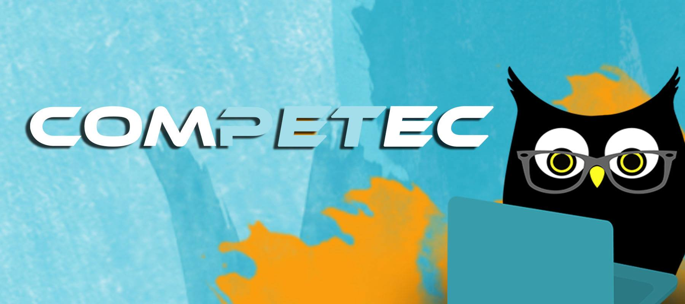

# 📓COMPETEC-2025

O COMPETEC é um programa do PET-SI EACH-USP voltado ao ensino de programação e linguagem Java para alunos de ETECs da Zona Leste de São Paulo. Com minicampeonatos de programação e aulas presenciais no campus da USP Leste, nosso objetivo é desenvolver habilidades essenciais de programação e despertar o interesse em uma carreira de computação.

## 📚 Manuais e Utilidades

- [Instruções de utilização do Github 🖥️](./Instruções%20de%20utilização%20do%20Github%20e%20gdb.pdf)

## 📒 Aulas

Conjunto de slides e resoluções de exercícios apresentados durante as aulas.

- Aula 0 - [Material](./aula-0/)
Tipos Primitivos, Operações Aritméticas, Impressão e Scanner

- Aula 1 - [Material](./aula-1/)
Comparações Lógicas, If/Else/Else If e Switch Case

- Aula 2 (revisão) - [Material](./aula-2%20(revisão)/)
Revisão de conceitos das aulas 1 e 2 + exercício de fixação

- Aula 3 - [Material](./aula-3/)
Repetições: While e For Loops 

## 📃 Exercícios de Fixação

Conjunto de exercícios recomendados aos alunos para que pratiquem programação fora da sala de aula.

- Aulas 0 e 1 - [Lista de Exercícios](./Exercícios%20de%20Fixação/Aulas%200%20e%201/)